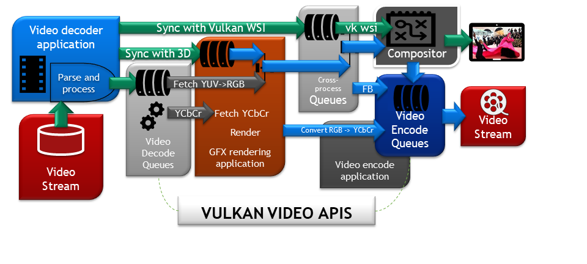

# VK_VULKAN_VIDEO

This project contains two Vulkan Video sample applications which demonstrate video decoding and encoding, respectively. Instructions on how to build either the encoder or decoder sample are present within the root folder.

## VK_VIDEO_DECODE

This project is a Vulkan Video Sample Application demonstrating an end-to-end, all-Vulkan, processing of h.264/5, AV1 compressed video content. The application decodes the compressed content using an HW accelerated decoder, the decoded YCbCr frames are processed with Vulkan Graphics and then presented via the Vulkan WSI.

Currently, the sample application supports Linux and Windows10 operating systems.

Features
========

- [x] Extracts (DEMUX via FFMPEG) compressed video from .mp4, .mkv, .mov and others video containers using h.264 (AVC), h.265 (HEVC) or AV1 compression formats.
- [x] The HW video decoder processes textures to Vulkan Video Images that can be directly sampled from Vulkan Samplers (Textures).
- [x] Converts the YCbCr (YUV) Images to RGB while sampling the decoded images using the [VK_KHR_sampler_ycbcr_conversion](https://www.khronos.org/registry/vulkan/specs/1.2-extensions/man/html/VK_KHR_sampler_ycbcr_conversion.html)
- [x] Displays the post-processed video frames using Vulkan WSI.
- [ ] Use Video display timing synchronization (such as VK_EXT_present_timing) at the WSI side - currently the video is played at the maximum frame rate that the display device can support. The video may be played at a faster rate than it is authored.

For instructions on how to build the sample decode application, please see [the build instructions.](https://github.com/KhronosGroup/Vulkan-Video-Samples/blob/main/BUILD.md)

Please download and install [Beta NVIDIA Driver with Vulkan Video Enabled](https://developer.nvidia.com/vulkan-driver).

For Vulkan Video Specification please refer to [Vulkan Spec with Video Extensions](https://www.khronos.org/registry/vulkan/specs/1.2-extensions/html/vkspec.html).

For deep-dive information on Vulkan Video please refer to the [Deep Dive Slide Deck](https://www.khronos.org/assets/uploads/apis/Vulkan-Video-Deep-Dive-Apr21.pdf).

## VK_VIDEO_ENCODE

This project is a Nvpro-based Vulkan Video sample application demonstrating video encoding. By using the Vulkan video encoding extensions to drive the HW-accelerated video encoder, this application encodes YCbCr content and writes the h.264, h.265 or AV1 compressed video to a file.

The sample is still in development and has issues such as missing POC numbers and corrupted frames.

Currently, the sample application supports Linux and Windows operating systems.

Features
========

- [x] Video encoding using h.264 standard
- [x] Support for all-Intra GOP structure
- [x] Support for P frames
- [x] Support for B frames
- [x] Encoding frames from graphical application
- [x] Different YCbCr chroma subsampling and bit depth options
- [x] Support for h.264 standard
- [x] Support for h.265 standard
- [x] Support for av1 standard
- [ ] Support for encoding tuning and quality levels
- [x] Better Support for rate control
- [x] Support for multi-threaded encoding
- [x] Tested 10-bit encoding

For instructions on how to build the sample decode application, please see [the build instructions.](https://github.com/KhronosGroup/Vulkan-Video-Samples/blob/main/BUILD.md)

Please download and install [Beta NVIDIA Driver with Vulkan Video Enabled](https://developer.nvidia.com/vulkan-driver).

For Vulkan Video Specification please refer to [Vulkan Spec with Video Extensions](https://www.khronos.org/registry/vulkan/specs/1.3-extensions/html/vkspec.html).

For deep-dive information on Vulkan Video please refer to the [Deep Dive Slide Deck](https://www.khronos.org/assets/uploads/apis/Vulkan-Video-Deep-Dive-Apr21.pdf).

## Enabling Vulkan Validation Layers

The Khronos Valiation Layer can be used for to verify the application correctly use the Vulkan API. There are two options for running the validation layers using the application.

### Option 1: Vulkan Configurator

Vulkan Configurator is installed with the Vulkan SDK. When Vulkan Configurator opens its GUI put the ticks opposite `VK_LAYER_KHRONOS_validation`, `VK_VALIDATION_VALIDATE_SYNC`, `VK_VALIDATION_THREAD_SAFETY`.

On Ubuntu

Make sure Qt is installed - it can be installed by executing `sudo apt install qt5-default`. To launch Vulkan Configurator GUI execute `vkconfig`.

On Windows

Vulkan Configurator is located in Start menu, in the Vulkan SDK folder. Vulkan Configurator can be launched from command-line shell `vkconfig`.

To turn off the Validation layers override click "Yes" when closing Vulkan Configurator window.

For more information on Vulkan Configurator please refer to the [LunarG, Using the Vulkan Configurator](https://vulkan.lunarg.com/doc/sdk/1.3.290.0/windows/vkconfig.html)

### Option 2: Environmental variables

Open command-line shell, execute the following commands to enable `VK_LAYER_KHRONOS_validation`, `VK_VALIDATION_VALIDATE_SYNC`, `VK_VALIDATION_THREAD_SAFETY`.

On Ubuntu:

`$ export VK_LOADER_LAYERS_ENABLE=*validation`

`$ export VK_VALIDATION_VALIDATE_SYNC=true`

`$ export VK_VALIDATION_THREAD_SAFETY=true`

`$ export VK_LOADER_LAYERS_DISABLE=~implicit~,*validation`

On Windows:

`C:\> set VK_LOADER_LAYERS_ENABLE=*validation`

`C:\> set VK_VALIDATION_VALIDATE_SYNC=true`

`C:\> set VK_VALIDATION_THREAD_SAFETY=true`

`C:\> set VK_LOADER_LAYERS_DISABLE=~implicit~,*validation`

Do not use `~all~` or `~explicit~` options with `VK_LOADER_LAYERS_DISABLE` because these options disable the validation layers that other applications might attempt to enable programmaticaly.

For more information on Layers configuration please refer to the [LunarG, Layers Configuration](https://vulkan.lunarg.com/doc/sdk/latest/windows/layer_configuration.html)
