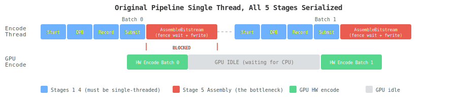
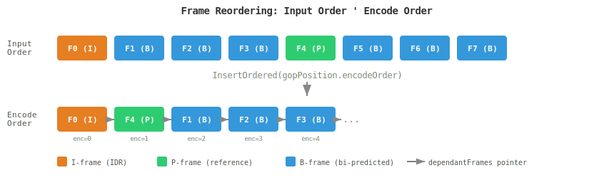
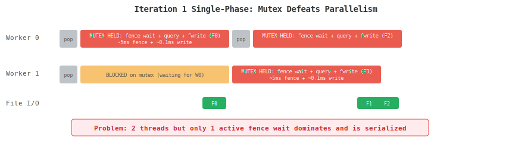
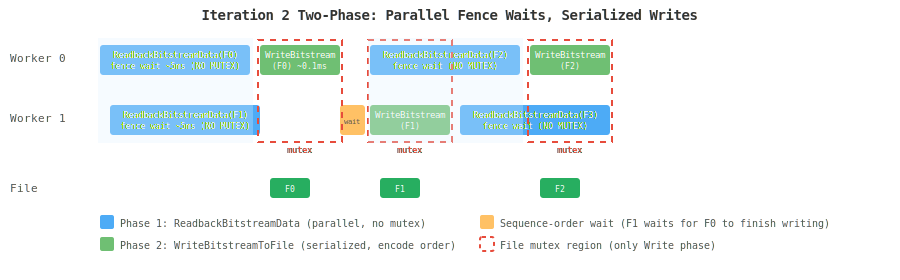
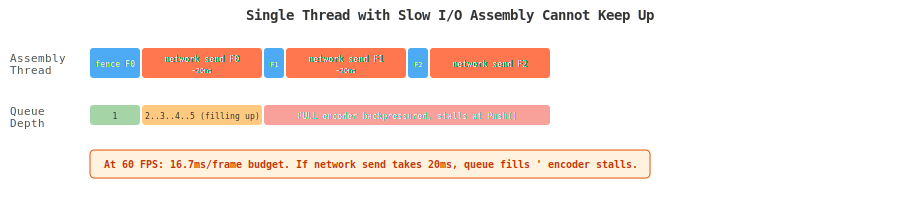
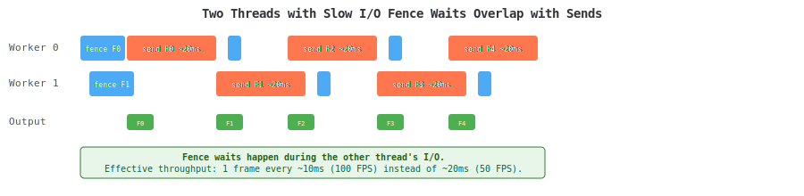

# Asynchronous Bitstream Assembly — Architecture

**Date:** 2026-03-20
**Author:** Tonly Zlatinski

---

## 1. The Original Problem

The Vulkan Video encoder processes each GOP batch through five sequential stages,
iterated over a linked list of `VkVideoEncodeFrameInfo` nodes **in encode order**:

| Stage | Function | What It Does |
|-------|----------|-------------|
| 1 | `StartOfVideoCodingEncodeOrder` | Assign encode-order sequence numbers |
| 2 | `ProcessDpb` | Manage Decoded Picture Buffer (reference frames) |
| 3 | `RecordVideoCodingCmd` | Record `vkCmdEncodeVideoKHR` into command buffer |
| 4 | `SubmitVideoCodingCmds` | Submit command buffer to GPU encode queue |
| 5 | `AssembleBitstreamData` | Wait for GPU, read results, write bitstream to file |

`ProcessOrderedFrames` runs each stage as a callback across ALL frames in the batch
before advancing to the next stage. This means all frames are submitted (stage 4)
before any assembly (stage 5) begins — but stage 5 still blocks the caller.

**Stages 1–4 must remain single-threaded.** They mutate shared encoder state: DPB
slot assignments, GOP counters, command buffer pools, and Vulkan queue submissions.
Running these in parallel would corrupt the DPB and produce invalid bitstreams.

**Stage 5 is the bottleneck.** For each frame it does:
1. `vkWaitForFences` — blocks CPU until GPU finishes encoding (~1–10ms at 1080p)
2. `GetQueryPoolResults` with `VK_QUERY_RESULT_WAIT_BIT` — redundant wait
3. `fwrite` of non-VCL headers + VCL data — disk I/O

While the CPU waits in stage 5, the GPU encode HW sits idle — no new work can be
submitted until assembly finishes and the encode thread returns to stage 1 of the
next batch.



---

## 2. Encode Order vs Input Order

Frames arrive at the encoder in **input (display) order**, but the GOP structure
reorders them into **encode order** for Decoded Picture Buffer (DPB) management.
Reference frames must be encoded before the B-frames that reference them.

`InsertOrdered` builds a singly-linked list (via `dependantFrames` pointers)
sorted by `gopPosition.encodeOrder`. `ProcessFrames` walks this list head-to-tail,
so all five pipeline stages execute in encode order.

**Example — GOP with 3 consecutive B-frames (gopFrameCount=8):**

```
Input  (display) order:  F0(I)  F1(B)  F2(B)  F3(B)  F4(P)  F5(B)  F6(B)  F7(B)
Encode (DPB)     order:  F0(I)  F4(P)  F1(B)  F2(B)  F3(B)  ...
```

The P-frame (F4) is encoded before the B-frames (F1–F3) it references, because
B-frames need the reconstructed P-frame in the DPB to form their predictions.



The assembly stage writes bitstream data to the output file in this same encode
order. For H.264/H.265, NAL units must appear in encode (decode) order. For AV1,
the IVF container writes frames in display order but encodes them out of order —
handled by the superframe batching described in section 3.

---

## 3. AV1 Superframe Batching

AV1 complicates the assembly stage because its IVF container expects frames
grouped into **superframes** written at display-order flush points.

AV1's GOP inserts `show_existing_frame` nodes into the encode-order linked list.
These nodes have **no HW encode, no fence, no bitstream buffer** — they instruct
the decoder to display a previously-encoded reference frame. They carry only a
small CPU-generated OBU header.

Non-visible frames (`show_frame=false`, typically B-frames that are encoded as
hidden ALTREFs) are encoded by HW but their bitstream is **buffered** in
`m_bitstream[frameIdx]` rather than written to the file. When a visible frame
arrives (`show_frame=true`), the encoder writes an IVF frame header with the
**combined size** of all accumulated bitstreams, then flushes everything as a
single IVF superframe.


This shared mutable state (`m_bitstream`, `m_batchFramesIndxSetToAssemble`)
is what makes naive multi-threading of the assembly stage dangerous for AV1.
The first design iteration handled this by serializing everything under a mutex,
which defeated the purpose of having multiple threads.

---

## 4. Design Iteration 1 — Single-Phase (Mutex Serialization)

The first attempt removed `AssembleBitstreamData` from the 5-stage callback list
and queued frames into a `VkThreadSafeQueue` after stage 4. Worker threads popped
items and called the virtual `AssembleBitstreamData` under a file mutex,
serialized by encode-order sequence numbers.

This correctly delegated codec-specific logic (AV1 superframe batching, H.264/H.265
NAL writing) through the existing virtual override chain. But because the **fence
wait** happened inside the virtual method, which ran entirely under the mutex,
only one worker thread could execute at a time.



The speedup came solely from decoupling the encode thread — it could submit the
next GOP batch while a single worker waited on fences. But the worker threads
themselves could not operate in parallel.

---

## 5. Design Iteration 2 — Two-Phase Parallel Assembly (Final)

The solution splits `AssembleBitstreamData` into two virtual methods:

| Method | Mutex? | What It Does |
|--------|--------|-------------|
| `ReadbackBitstreamData` | **No** — runs freely in parallel | Fence wait, query results, optional memcpy |
| `WriteBitstreamToFile` | **Yes** — serialized in encode order | File I/O, IVF framing, AV1 batch accumulation |

**H.264/H.265 (base class):**
- `ReadbackBitstreamData`: fence wait + query. No memcpy — VCL data stays in the GPU
  mapped bitstream buffer until the write phase.
- `WriteBitstreamToFile`: reads directly from the GPU mapped buffer and writes to file.

**AV1 (override):**
- `ReadbackBitstreamData`: fence wait + query + **memcpy** of VCL data into
  `readback.bitstreamCopy`. The copy is required because non-visible frames
  release their GPU bitstream buffer before the flush point arrives.
- `WriteBitstreamToFile`: accumulates buffered data in `m_bitstream[]`, writes
  IVF superframe on flush, or writes show-existing-frame OBU header.



---

## 6. Synchronization and Ordering

### Sequence Number Assignment

The encode thread (single producer) assigns monotonically increasing sequence
numbers when queuing frames for assembly:

```cpp
item.sequenceNumber = m_assemblySequenceCounter++;  // atomic, single writer
m_assemblyQueue.Push(item);
```

### Ordered File Write

Workers wait on a condition variable gated by their sequence number. Only the
worker whose sequence number matches `m_nextWriteSequence` enters the write phase:

```cpp
// Phase 1: readback (parallel, no mutex)
ReadbackBitstreamData(frame, item.readback);

// Phase 2: write (serialized in encode order)
{
    unique_lock lock(m_assemblyFileMutex);
    m_assemblyOrderCV.wait(lock, [&] {
        return item.sequenceNumber == m_nextWriteSequence.load();
    });
    WriteBitstreamToFile(frame, ..., item.readback);
    m_nextWriteSequence++;
}
m_assemblyOrderCV.notify_all();
```

### Backpressure

`VkThreadSafeQueue` has bounded capacity (`numBitstreamBuffersToPreallocate`,
default 8). When the queue is full, `Push` blocks the encode thread until a
worker pops an item. This naturally limits in-flight frames and prevents
unbounded memory growth.

### VkThreadSafeQueue Bug Fix

The original `WaitAndPop` had a shutdown deadlock:

```cpp
// BEFORE (bug): consumers never wake on flush
m_condConsumer.wait(lock, [this]{
    return (m_queueIsFlushing == false) && !m_queue.empty();
});

// AFTER (fix): wake on flush OR new data
m_condConsumer.wait(lock, [this]{
    return m_queueIsFlushing || !m_queue.empty();
});
```

Also `SetFlushAndExit` changed from `notify_one` to `notify_all` for
multi-consumer correctness.


---

## 7. Resource Lifetime

Each `AssemblyWorkItem` holds a `VkSharedBaseObj<VkVideoEncodeFrameInfo>` which
bumps the reference count. This keeps the frame and all its child resources alive
until the assembly worker releases them:

| Resource | Held By | Released When |
|----------|---------|--------------|
| `outputBitstreamBuffer` | `VkSharedBaseObj` in frame | `Reset(true)` after write |
| `encodeCmdBuffer` (owns fence + query pool) | `VkSharedBaseObj` in frame | `Reset(true)` after write |
| DPB image references | `VkSharedBaseObj` in frame | `Reset(true)` after write |
| Staging images | `VkSharedBaseObj` in frame | `Reset(true)` after write |

`ReleaseAssemblyItem` calls `frameInfo->Reset(true)` which drops all child
`VkSharedBaseObj` references. When each resource's refcount reaches the pool
threshold (1 = only pool's own ref remains), it automatically returns to the pool
via `ReleasePoolNodeToPool`.

**Pool sizing:** with async assembly, frames stay alive longer (in the queue +
during readback). To prevent pool exhaustion (observed as AV1 DPB assertion at
high frame counts), pool sizes are increased by `numBitstreamBuffersToPreallocate`
(the assembly queue capacity) when async mode is enabled:

```cpp
if (m_encoderConfig->asyncAssembly) {
    m_encoderConfig->numInputImages += m_encoderConfig->numBitstreamBuffersToPreallocate;
}
```

This gives all pools (input images, DPB images, command buffers, frame info nodes)
enough slack for the additional in-flight frames held by the assembly pipeline.

---

## 8. Thread Count Design Rationale

### Why the speedup comes from decoupling, not parallelism

The 20–30% throughput gain does **not** come from parallel fence waits across
multiple assembly threads. It comes from **decoupling** the encode submission
thread from the assembly stage entirely. The encode thread submits a GOP batch
(stages 1–4) and returns immediately. A separate thread handles the fence wait
and file write while the encode thread prepares and submits the next batch.

With a single dedicated assembly thread, the pipeline looks like this:

```
Encode thread:  [S1-S4 Batch0] [S1-S4 Batch1] [S1-S4 Batch2] ...
                      │              │              │
Assembly thread:      └─ fence(F0) write(F0) fence(F1) write(F1) ...
```

The GPU encode HW is deeper-pipelined than the assembly latency: by the time
assembly finishes frame N and moves to frame N+1, the GPU has already finished
encoding N+1. The fence wait returns near-instantly for all but the first frame
in each burst.

**One assembly thread is sufficient for local file I/O** — the write phase is
~0.1ms per frame (a small `fwrite` of the compressed bitstream), negligible
compared to the ~5–10ms fence wait at 1080p.

### When multiple threads matter: network and slow I/O

If the output destination is a **network stream** (e.g., live streaming over
TCP/RTMP) or **slow storage** (e.g., NFS, spinning disk), the write phase can
take significantly longer — potentially 5–50ms per frame depending on network
latency and bandwidth.

In this scenario, a single assembly thread becomes I/O-bound:



With **N assembly threads** and the two-phase design, this bottleneck is mitigated.
While thread 0 is blocked on network send for frame N, thread 1 has already
completed its fence wait for frame N+1 (the GPU finished it long ago) and is
ready to write the moment thread 0 releases the file mutex:



### Recommendation

| Scenario | Thread Count | Rationale |
|----------|-------------|-----------|
| Local file on fast SSD | 1 | Write is ~0.1ms, negligible. Simplest. |
| Local file on spinning disk | 2 | Overlaps fence wait with occasional I/O stall. |
| Network stream (LAN) | 2–4 | Overlaps fence waits with ~1–5ms network sends. |
| Network stream (WAN/cloud) | 4–8 | Overlaps fence waits with ~10–50ms sends. |
| Memory buffer (no I/O) | 1 | No write latency at all. |

The default `assemblyThreadCount=2` is a reasonable compromise: it handles the
common case (local file) with minimal overhead, while providing overlap benefit
if the output path has moderate latency. Users targeting high-latency outputs
can increase it with `--assemblyThreads N`.

---

## Performance Results

| Resolution | H.264 | H.265 | AV1 |
|-----------|-------|-------|-----|
| 352x288 (CIF) | ~0% | +4–8% | ~0% |
| 1920x1080 | **+22–28%** | **+26–35%** | **+17–19%** |
| 3840x2160 (4K) | +6% | +6% | +2% |

Average speedup at HD+ resolutions: **+20–38%** depending on GPU
(RTX 5080 Blackwell: +20.7%, RTX 3080 Ti Ampere: +38.2%).

The speedup scales with encode HW latency — at higher resolutions the fence
wait is longer, giving more opportunity for the encode thread to submit
new work while workers wait in parallel.

---

## Source Files

| File | Key Contents |
|------|-------------|
| `VkVideoEncoder.h` | `BitstreamReadback`, `AssemblyWorkItem`, virtual method declarations |
| `VkVideoEncoder.cpp` | `ProcessOrderedFrames`, `AssemblyWorkerThread`, `ReadbackBitstreamData`, `WriteBitstreamToFile`, init/shutdown |
| `VkVideoEncoderAV1.cpp` | AV1 overrides for readback (memcpy) and write (IVF batching), `WriteShowExistingFrameHeader` |
| `VkEncoderConfig.h` | `asyncAssembly`, `assemblyThreadCount` config fields |
| `VkThreadSafeQueue.h` | Fixed `WaitAndPop` condition, `notify_all` in `SetFlushAndExit` |
