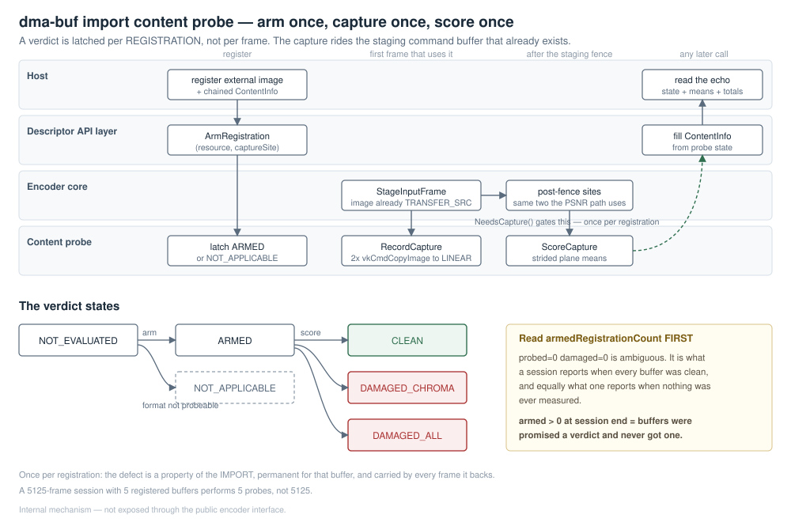

# The dma-buf import content probe

**Status:** internal mechanism. It is not part of the public encoder interface, and this
document does not propose making it one.

---

## 1. The failure it exists to catch

A dma-buf import can succeed at every level the API can report on — `vkAllocateMemory`,
`vkBindImageMemory`, image view creation, all `VK_SUCCESS` — and still bind an image to memory
the producer's writes never reach. The encoder then encodes that image faithfully and emits a
structurally valid bitstream of a dead or green frame.

Nothing else in the library can see this. Every layer above works from handles and descriptors,
and those are all correct; the damage is only visible in the pixels. The probe is the only place
that reads imported pixels on the host, so it is the only place that can hold an opinion.

## 2. The shape of the answer

The verdict is latched **per registration**, not per frame.

The defect is a property of the import: it is permanent for the life of that buffer, a damaged
import is not recoverable, re-importing at the next ordinal rescues it in 0 of 8 attempts, and
100% of the frames backed by a damaged buffer carry the damage. A second look therefore costs a
readback and can learn nothing. A 5125-frame session with 5 registered buffers performs 5 probes,
not 5125.

## 3. The sequence

| # | When | Call | What happens |
|---|---|---|---|
| 1 | Encoder initialisation | `Configure()` | Pool depth is the encode queue depth **+ 2**: a node is held from the record site until the post-fence score, so the in-flight set can briefly exceed the queue depth |
| 2 | The host registers an external buffer | `ArmRegistration(resource, captureSite)` | State becomes `ARMED`, or `NOT_APPLICABLE` when the readback cannot ride this registration. Latched here rather than discovered per frame, so the answer travels back in the registration echo |
| 3 | First frame that uses the registration | `NeedsCapture()` gates `RecordCapture()` | Two `vkCmdCopyImage` — Y and UV — appended to the staging command buffer that already exists, one command after `CopyLinearToOptimalImage` has read the same image in the same layout. No extra submit, fence or queue; the image is already in `TRANSFER_SRC_OPTIMAL` |
| 4 | After that command buffer's fence is waited | `ScoreCapture()` | Host-side strided plane means off a `HOST_VISIBLE｜HOST_COHERENT` LINEAR pool image, from the same two post-fence sites the PSNR readback uses |
| 5 | Any later call | chained `VkVideoEncoderImportContentInfo` | The caller reads `state`, `meanY/U/V` and the session totals |
| — | Unregistration | `ForgetRegistration()` | Per-registration state is erased. Session totals are deliberately **not** decremented |

`ScoreCapture()` must run only after the fence has been waited. The capture is recorded into the
caller's command buffer; the score reads host memory that is only valid once that submission has
completed.

## 4. The predicate

A plane is dead when its mean is **strictly below 2.0/255**, expressed in Q8 as
`kDeadPlaneMeanQ8 = 512`. The public constant
`VK_VIDEO_ENCODER_IMPORT_CONTENT_DEAD_PLANE_MEAN_Q8` must equal it, and a `static_assert` pins
the two together.

| State | Meaning |
|---|---|
| `NOT_EVALUATED` | No verdict. The registration was never armed, or has been forgotten |
| `NOT_APPLICABLE` | The readback cannot ride this registration, so no verdict is possible |
| `ARMED` | A verdict was promised and has not arrived yet |
| `CLEAN` | Scored, and no plane is dead |
| `DAMAGED_CHROMA` | The chroma planes are dead, luma is not |
| `DAMAGED_ALL` | Every plane is dead |

Only `VK_FORMAT_G8_B8R8_2PLANE_420_UNORM` is probeable. The predicate is stated over Y, U and V
plane means, so a format with no chroma planes to score has no verdict to give, and a 10- or
12-bit packed format stores its samples in the high bits of 16-bit words — a byte-wise mean would
be reading the wrong half. Widening this means teaching the scorer the word layout, not adding a
case to the predicate, and `NOT_APPLICABLE` is the honest answer until someone does.

Only every 8th row of each plane is read (`kRowStride`). That is a requirement rather than a
micro-optimisation: a byte-wise walk of the same 3.1 MB of `HOST_VISIBLE` memory costs
`VkVideoEncoderPsnr` the difference between ~200 fps and 3.6 fps. A strided mean is ample for
"is this plane dead", which is the only question asked.

## 5. Read `armedRegistrationCount` before believing anything else

`probedRegistrationCount == 0 && damagedRegistrationCount == 0` is **ambiguous**. It is what a
session reports when every buffer was probed and every one was clean, and it is equally what a
session reports when no capture ever ran.

`armedRegistrationCount` is what tells them apart: it counts registrations that were promised a
verdict and have not reached one.

* Non-zero **transiently** is expected and correct — a registration is armed at import and scored
  a frame or two later, so a mid-session poll legitimately catches buffers in flight.
* Non-zero **at the end of a session**, or in a long-running session where it never falls, means
  the capture site is not being reached. The absence of damage reports is then an absence of
  *measurement*, not an absence of damage.

A consumer that reports "no damage" without checking this field cannot distinguish a healthy
session from a probe that never ran.

`probeGeneration` is a non-zero build constant stamped on every path, including the paths that
produce no verdict. It is the writer proof: a zeroed structure means nothing filled it in.

## 6. What it deliberately does not do

**It does not write to stderr.** A host that silences stdio, or that runs the encoder in a child
process whose stderr it never reads, would lose every finding — and a diagnostic whose only signal
can be discarded by the caller it exists for tells that caller nothing. Every answer leaves through
the chained structure, which the caller must read.

**It does not decrement session totals on unregistration.** "Three of the buffers this session
imported were damaged" stays true after those three are retired, and a consumer watching a falling
total would conclude the damage went away.

**It does not re-probe.** See §2.

## 7. Reachability

The probe is internal, and the structures that carry its verdict —
`VkVideoEncoderImportContentInfo`, `VkVideoEncoderImportContentState` and the companion
`VkVideoEncoderImportGuardInfo` — are declared in the descriptor API's internal header, which is
not on any consumer's include path.

Its consumers are the library's own white-box tests: `encoder-ext-import-content`,
`encoder-ext-import-guard` and `encoder-ext-format-encode --content-probe`. Those tests name the
internal directory explicitly in their build, which is the point — a test that reaches past the
public surface should have to say so.

The public C++ encoder interface does not expose the probe and is not intended to. A host that
needs import verification today gets it by running those tests against its own configuration, not
by chaining a structure at runtime.
